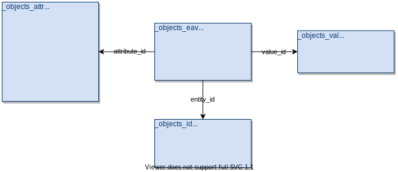

# forge-props-service

Simple Node.js microservice (and a command line tool) allowing custom sqlite queries over the property database of Autodesk Forge models.

The service downloads _objects\_*.json.gz_ files (see https://github.com/wallabyway/propertyServer/blob/master/pipeline.md#property-pipeline
to learn more about those) of the input Forge model and converts them into a local sqlite file with the following schema:



The sqlite database can then queried through a specific endpoint.

## Usage

### Server

- Install npm dependencies: `npm install`
- Start the server: `npm start`

> Each of the HTTP requests listed below require that you include an `Authorization` header with a bearer token
> that can access the Forge Model Derivative service (only the `viewables:read` scope is neeeded).

1. Make a POST request to `/:urn` to start preparing the sqlite database for one of your Forge models
  - _:urn_ is a base64-encoded ID of the model
  - The sqlite database will be cached locally, under the _cache_ folder
2. Make a GET request to `/:urn` to check the status of the sqlite processing
  - If you see `{ "status": "running", ... }`, the database preparation is still in progress
  - If you see `{ "status": "failed", ...}`, the processing failed, and the JSON will include additonal information
  - If you see `{ "status": "complete", ...}`, you can move to the next step
3. Make a GET request to `/:urn/properties[?q=<query>]` to query the property database
  - If the _q_ parameter is not provided, a default SQL query is used, listing properties of all objects
  - You can access the following tables in the query: `objects_attrs`, `objects_avs`, `objects_ids`, and `objects_vals`
  - The database also provides a view called `properties` that combines all the tables and exposes all public properties

### Command line

You can also generate the property database locally via scripts in the _bin_ folder.

- Install npm dependencies: `npm install`
- Run the _convert-local.js_ script to process a property database stored on a local filesystem:

`convert-local.js <path to folder with input *.json.gz files> <path to output sqlite file>`

- Or, run the _convert-forge.js_ script to process a property database of a model in Forge
(in this case you'll need to provide `FORGE_CLIENT_ID` and `FORGE_CLIENT_SECRET` env. variables
or a `FORGE_ACCESS_TOKEN` env. variable with a ready-to-use token):

`FORGE_CLIENT_ID=<client id> FORGE_CLIENT_SECRET=<client secret> convert-forge.js <input model URN> <path to output sqlite file>`

### Example queries

#### Get all public properties

```sql
    SELECT ids.id AS dbid, attrs.category AS category, IFNULL(attrs.display_name, attrs.name) AS name, vals.value AS value
    FROM _objects_eav eav
    LEFT JOIN _objects_id ids ON ids.id = eav.entity_id
    LEFT JOIN _objects_attr attrs ON attrs.id = eav.attribute_id
    LEFT JOIN _objects_val vals on vals.id = eav.value_id
    WHERE category NOT LIKE '\_\_%\_\_' ESCAPE '\' /* skip internal properties */
    ORDER BY dbid
```

Or using the pre-defined `properties` view:

```sql
    SELECT * FROM properties ORDER BY dbid
```

#### Get all properties in the "Construction" category

```sql
    SELECT ids.id AS dbid, attrs.category AS category, IFNULL(attrs.display_name, attrs.name) AS name, vals.value AS value
    FROM _objects_eav eav
    LEFT JOIN _objects_id ids ON ids.id = eav.entity_id
    LEFT JOIN _objects_attr attrs ON attrs.id = eav.attribute_id
    LEFT JOIN _objects_val vals on vals.id = eav.value_id
    WHERE category = 'Construction'
```

Or using the pre-defined `properties` view:

```sql
    SELECT * FROM properties WHERE category = 'Construction'
```

#### Get the dbIDs of all children of dbID 123

```sql
    SELECT ids.id AS dbid, vals.value AS child_id
    FROM _objects_eav eav
    LEFT JOIN _objects_id ids ON ids.id = eav.entity_id
    LEFT JOIN _objects_attr attrs ON attrs.id = eav.attribute_id
    LEFT JOIN _objects_val vals on vals.id = eav.value_id
    WHERE dbid = 123 AND attrs.category = '__child__'
```

#### Get the sum of all "Volume" property values

```sql
    SELECT SUM(vals.value) AS total_volume
    FROM _objects_eav eav
    LEFT JOIN _objects_id ids ON ids.id = eav.entity_id
    LEFT JOIN _objects_attr attrs ON attrs.id = eav.attribute_id
    LEFT JOIN _objects_val vals on vals.id = eav.value_id
    WHERE IFNULL(attrs.display_name, attrs.name) = 'Volume'
```

Or using the pre-defined `properties` view:

```sql
    SELECT SUM(value) AS total_volume FROM properties WHERE name = 'Volume'
```
